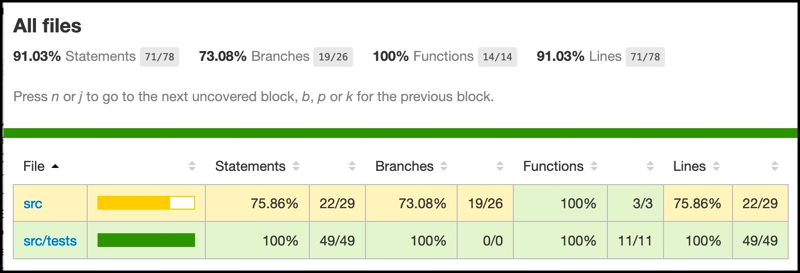

🤖🙊 This is my typescript homework. I will learn 
 * how to setup typescript project 
 * how to run tests.

# Requirements
 * Mac (I haven't tested on Windows and Linux. You may try it)
 * docker >= 19.03
 * docker-compose >= 1.26

# Setup Project (First time only)
 1. Go to current project folder and run docker.
    ```
    docker-compose up -d
    ```
 1. Install dependencies
    ```
    docker-compose exec frontend npm install
    ```

# Run Tests
```
docker-compose exec frontend npm run test
```
Sample output <br/>  <br/>

# Run Test Coverage
```
docker-compose exec frontend npm run coverage
```
Then, open file 'project/coverage/index.html' in chrome. <br/>
Sample output <br/>  <br/>

# Tennis Rules
+ A game is won by the first player to have won at least four points in total and at least two points more than the opponent.
+ The running score of each game is described in a manner peculiar to tennis: scores from zero to three points are described as “love”, “fifteen”, “thirty”, and “forty” respectively.
+ If at least three points have been scored by each player, and the scores are equal, the score is “deuce”.
+ If at least three points have been scored by each side and a player has one more point than his opponent, the score of the game is “advantage” for the player in the lead.

## Alternate explanations

+ Each player can have either of these points in one game 0 15 30 40
+ If you have 40 and you win the ball you win the game, however there are special rules.
+ If both have 40 the players are deuce. a. If the game is in deuce, the winner of a ball will have advantage and game ball. b. If the player with advantage wins the ball he wins the game c. If the player without advantage wins they are back at deuce.
